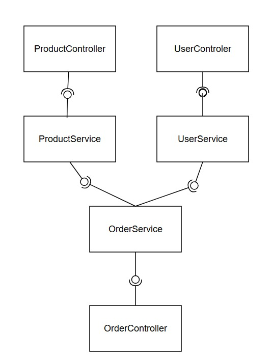

## juan lopez, nicolas ibañez

## punto 1 funcionalidades

### registro de usuario

#### a) Verbo http: 
POST

#### b) 
No idempotente

#### c) 
Cada llamada crea un nuevo recurso (usuario) en el sistema. Dos requests con los mismos datos generan conflicto o duplicado, no el mismo resultado.

#### d) 
Sin rol

#### e) 

| Campo (Request) | Tipo | Obligatorio |
|-----------------|------|-------------|
| nombre | String | SI |
| email | String | SI |
| contrasena | String | SI |

| Campo (Response) | Tipo | Siempre presente |
|------------------|------|-----------------|
| id | UUID | SI |
| nombre | String | SI |
| email | String | SI |

#### f)

Request:

    {
      "nombre": "Juan Pérez",
      "email": "juan@mail.escuelaing.edu.co",
      "contrasena": "Pass123!"
    }

Response 201 Created:

    {
      "id": "a1b2c3d4-...",
      "nombre": "Juan Pérez",
      "email": "juan@mail.escuelaing.edu.co",
    }

#### g)

- Input: email con formato válido: "@mail.escuelaing.edu.co"
- Validaciones de negocio: El email no tiene que ya estar registrado en el sistema

#### H)

| Escenario | Código | Mensaje |
|-----------|--------|---------|
| Happy Path | 201 | Usuario creado exitosamente |
| Email ya registrado | 409 | El correo ya se encuentra registrado |
| Campos inválidos | 400 | Los datos ingresados no son válidos |
| Error interno | 500 | Error interno del servidor |

### Autentificacion - Login

#### a) Verbo http:
POST

#### b)
No idempotente

#### c)
Cada llamada crea un nuevo recurso (usuario) en el sistema. Dos requests con los mismos datos generan conflicto o duplicado, no el mismo resultado.

#### d)
Sin rol

#### e)

| Campo (Request) | Tipo | Obligatorio |
|-----------------|------|-------------|
| email | String | SI |
| contrasena | String | SI |

| Campo (Response) | Tipo | Siempre presente |
|------------------|------|-----------------|
| token | String (JWT) | SI |
| tipo | String | SI |
| usuarioId | UUID | SI |
| nombre | String | SI |

#### f)

Request:

    {
      "email": "juan@email.com",
      "contrasena": "Pass123!"
    }

Response 200 OK:

    {
      "token": "eyJhbGciOiJIUzI1NiIs...",
      "tipo": "CLIENTE",
      "usuarioId": "a1b2c3d4-...",
      "nombre": "Juan Pérez"
    }

#### g)

- Input: email con formato válido, contraseña no vacía
- Negocio: el email debe estar registrado, la contraseña debe coincidir con la almacenada

#### H)

| Escenario | Código | Mensaje |
|-----------|--------|---------|
| Happy Path | 200 | Autenticación exitosa |
| Credenciales incorrectas | 401 | Credenciales inválidas |
| Campos inválidos | 400 | Los datos ingresados no son válidos |
| Error interno | 500 | Error interno del servidor |

### Consulta Producto QR

#### a) Verbo http:
get

#### b)
idempotente

#### c)
Es una operación de solo lectura. Múltiples llamadas con los mismos parámetros retornan el mismo resultado sin modificar el estado del servidor.

#### d)
usuarios registrados

#### e)

| Campo (Request) | Tipo | Obligatorio |
|-----------------|------|-------------|
| CodQR           | String | SI          |

| Campo (Response) | Tipo                                | Siempre presente |
|------------------|-------------------------------------|-----------------|
| CodQR            | String                              | SI |
| nombre           | String                              | SI |
| descripcion      | String                              | SI |
| precio           | Double                              | SI |
| stock            | Integer                             | SI |
| estado           | String (disponible / no disponible) | SI |

#### f)

Request: GET /productos?CodQR=String

Response 200 OK:

    [
      {
        "CodQR": "1111110...",
        "nombre": "cafe con leche",
        "descripcion": "cafe con leche no espumado caliente",
        "precio": 2500.00,
        "stock": 100,
        "estado": "disponible"
      }
    ]

#### g)

- Input: QR existente con formato válido: "1111110010101011111....."
- Validaciones de negocio: El QR debe de identificar un producto, si no, no es valido.

#### H)

| Escenario | Código | Mensaje |
|-----------|--------|---------|
| Happy Path | 200 | Producto retornado exitosamente |
| Producto no encontrado | 404 | Producto no encontrado |
| ID con formato inválido | 400 | El identificador proporcionado no es válido |
| No autenticado | 401 | No autorizado |
| Error interno | 500 | Error interno del servidor |

### Crear Pedido

#### a) Verbo http:
POST

#### b)
no idempotente

#### c)
Cada llamada agrega o incrementa la cantidad de un producto en el carrito, modificando el estado del recurso. Dos llamadas iguales no producen el mismo resultado final.

#### d)
Cliente

#### e)

| Campo (Request) | Tipo    | Obligatorio |
|-----------------|---------|-------------|
| productoId | String  | SI |
| cantidad | Integer | SI |

| Campo (Response) | Tipo | Siempre presente |
|------------------|------|-----------------|
| OrderId          | UUID | SI |
| productos        | List\<ItemCarrito\> | SI |
| total            | Double | SI |

| Campo (ItemOrder) | Tipo    |
|-------------------|---------|
| productoId        | String  |
| nombre            | String  |
| cantidad          | Integer |
| precioUnitario    | Double  |
| subtotal          | Double  |

#### f)

Request: POST /carrito/items

    {
      "productoId": "11111001...",
      "cantidad": 2
    }

Response 201 Created:

    {
      "orderId": "c1d2e3...",
      "productos": [
        {
          "productoId": "p1b2c3...",
          "nombre": "cafe",
          "cantidad": 2,
          "precioUnitario": 1500.00,
          "subtotal": 3000.00
        }
      ],
      "total": 3000.00
    }

#### g)

- Input:  productoId debe ser QR válido, cantidad debe ser mayor a 1
- Negocio: el producto debe existir y estar disponible, la cantidad solicitada no debe superar el stock disponible, un usuario solo debe de tener un pedido ACTIVO, los pedidos inician en estado CREADO

#### H)

| Escenario | Código | Mensaje |
|-----------|--------|---------|
| Happy Path | 201 | Producto agregado al carrito exitosamente |
| Stock insuficiente | 409 | Stock insuficiente para la cantidad solicitada |
| Producto no encontrado | 404 | Producto no encontrado |
| Campos inválidos | 400 | Los datos ingresados no son válidos |
| No autenticado | 401 | No autorizado |
| Error interno | 500 | Error interno del servidor |

### actualizar pedido 

#### a) Verbo http:
PATCH

#### b)
idempotente

#### c)
Cada llamada actualiza un recurso (order) en el sistema. Dos requests con los mismos datos no generan conflicto o duplicado, por lo tante el mismo resultado.

#### d)
administrador

#### e)

| Campo (Request) | Tipo   | Obligatorio |
|-----------------|--------|-------------|
| orderID         | UUID   | SI |
| status          | String | SI |

| Campo (Response) | Tipo | Siempre presente |
|------------------|------|-----------------|
| ordenId | UUID | SI |
| estado | String | SI ||
| resumen | List\<ItemOrden\> | SI |
| total | Double | SI |

| Campo (ItemOrden) | Tipo    |
|-------------------|---------|
| productoId | String  |
| nombre | String  |
| cantidad | Integer |
| subtotal | Double  |

#### f)

Request: PATCH /ordenes/{ordenId}/pago

    {
      "status": "EN_PREPARACION",
      "orderId": "TXN-98765"
    }

Response 200 OK:

    {
      "ordenId": "o1p2q3...",
      "estado": "EN_PREPARACION",
      "transaccionId": "TXN-98765",
      "resumen": [
        {
          "productoId": "p1b2c3...",
          "nombre": "cafe",
          "cantidad": 2,
          "subtotal": 1500.00
        }
      ],
      "total": 3000.00,
    }

#### g)

- Input: Status no debe ser CANCELADO, orderId no vacío
- Negocio: la orden debe existir, actualizar stock de cada producto

#### H)

| Escenario | Código | Mensaje                                                            |
|-----------|--------|--------------------------------------------------------------------|
| Happy Path | 200 | orden modificada, orden actualizada exitosamente                   |
| Orden no encontrada | 404 | Orden no encontrada                                                |
| Orden en estado inválido | 409 | La orden no se encuentra en un estado válido para procesar el pago |
| No autenticado | 401 | No autorizado                                                      |
| Error interno | 500 | Error interno del servidor                                         |

### Cancelar orden

### actualizar pedido

#### a) Verbo http:
PATCH

#### b)
idempotente

#### c)
Cada llamada actualiza un recurso (order) en el sistema. Dos requests con los mismos datos no generan conflicto o duplicado, por lo tante el mismo resultado.

#### d)
Cliente y Administrador

#### e)

| Campo (Request) | Tipo   | Obligatorio |
|-----------------|--------|-------------|
| orderID         | UUID   | SI |
| status          | String | SI |

| Campo (Response) | Tipo | Siempre presente |
|------------------|------|-----------------|
| ordenId | UUID | SI |
| estado | String | SI ||
| resumen | List\<ItemOrden\> | SI |
| total | Double | SI |

| Campo (ItemOrden) | Tipo    |
|-------------------|---------|
| productoId | String  |
| nombre | String  |
| cantidad | Integer |
| subtotal | Double  |

#### f)

Request: PATCH /ordenes/{ordenId}/pago

    {
      "status": "CANCELADO",
      "orderId": "TXN-98765"
    }

Response 200 OK:

    {
      "ordenId": "o1p2q3...",
      "estado": "CANCELADO",
      "transaccionId": "TXN-98765",
      "resumen": [
        {
          "productoId": "p1b2c3...",
          "nombre": "cafe",
          "cantidad": 2,
          "subtotal": 1500.00
        }
      ],
      "total": 3000.00,
    }
###G)

- Input: Status solo debe ser CREADO, orderId no vacío.
- Validaciones de negocio: El cliente puede cancelar el pedido solo en estado CREADO

#### H)

| Escenario | Código | Mensaje                                                            |
|-----------|--------|--------------------------------------------------------------------|
| Happy Path | 200 | orden cancelada, orden actualizada exitosamente                    |
| Orden no encontrada | 404 | Orden no encontrada                                                |
| Orden en estado inválido | 409 | La orden no se encuentra en un estado válido para procesar el pago |
| No autenticado | 401 | No autorizado                                                      |
| Error interno | 500 | Error interno del servidor                                         |

## 2: Explique la diferencia entre Validaciones de input y Validaciones de negocio
#### respuesta:

Input: Valida que los datos ingresados sean correctos o validos, no vacios, que no tengan valores no permitidos, etc

Negocio: Validan las reglas internas de la aplicacion, por ejemplo que no se pueda agregar un producto sin stock

## 3: Explique la diferencia entre autenticación, autorización e integridad.
#### respuesta: 
auntenticacion: Verificar que un usuario es quien dice ser  
autorizacion: Verificar si un usuario tiene permisos para realizar cierta accion  
integridad: Asegurarse que los datos no se hayan alterado en el transporte  

## 4: Genere el diagrama de componentes específicos del sistema ECIXPRESS

## 5: ¿Qué problemas pueden surgir si no se separan correctamente las capas dentro de un proyecto de software?
#### respuesta:
la lectura del proyecto se vuelve muy complicada, los niveles de complejidad a pedir una fncionalidad no son optimos, dificulta encontrar errores, se dificulta añadir funcionalidades, se dificulta identificar deudas.

## 6: Genere el diagrama de componentes específicos del sistema ECIXPRESS

## 7: ¿Cuáles son las diferencias entre un validador, una utilidad y un servicio?
#### respuesta: 
un validador verifica que se cumplan las reglas de negocio, una utilidad sirve como dice su nombre para partes no funcionales pero importatntes (ej: creador de UUID), y servicios implican las funcionalidades del sistema

## 8:  Genere el diagrama de clases de los modelos y responda: ¿Qué patrón de software usaría para manejar los estados del pedido y por qué?

Observer: este patron nos permitiria notificar a los servicios cada vez que el estado de un pedido pase a "en proceso" para poder permitir al stock actualizarse automaticamente

State: de esta manera los etados no dependerian de un if o un swich, se manejarian como un objeto aparte, asi por ejemplo solo el "objeto" creado tendra la funcion de "cancelar"

## 9 Genere el diagrama entidad-relación para el marco relacional de persistencia.

## 10.Proponga 2 índices que mejoren el rendimiento de las consultas de  ECIXPRESS y establezca con un criterio técnico el porque dan valor a la solución.

### Indices: 

Order.userid sin el indice la base de datos recorreria toda la tabla Order en busca de coincidencias, asi la busqueda seria directa

Order_item.orderId: con este indice solo se consultar los order items que esten asociados a dicho order en lugar de recorrer toda la tabla mejorando el tiempo de consulta

## 13.Nuestro cliente quiere automatizar el proceso del ciclo de vida de la aplicación, sin embargo necesita entender cómo funciona, describa las etapas principales de un pipeline y en qué consiste cada una.

#### RTA: Las pipe lines se componen principalmente de 5 partes 1. el build donde se verificara que todo lo referente a la compilacion del proyecto

1. Construccion: compila el proyecto ademas de verificar que no hayan errores
2. Test: ejecuta las pruebas unitarias con ayuda de mvn para comprobar que todo funcione correctamente
3. Analisi: mediante jacoco y sonar se comprueban la cobertura y analisis estatico del codigo
4. Construccion de imagen: construccion de una imagen para el despliege
5. Deploy, Se despliega la aplicación en un entorno destinado desde una imagen

## 14 ¿Qué sucede si una prueba falla en el pipeline? ¿Debe permitirse el despliegue? Justifique

Si una prueba falla no deberia permitirse el despliege ya que la pipeline existe como un "perro guardian :D"
que verificara paso por paso que lo que se mando no rompa lo ya existente, asi el desarrollador debera
revisar el error corregirlo y volver a pasar por la verificacion de la pipeline para que de esta manera
se permita el despliege si no hay fallos.

## 15. Explique el concepto de logging en el manejo de errores:

### a. ¿Qué información debería registrarse?

La etiquetas de tiempo del error
El tipo de error
Mensaje con una descripcion del fallo
Id de usuario

### b. ¿Qué NO debería registrarse (por seguridad)?

Contraseña
Toker de acceso
Datos del usuario(emal,numeros)
Numeros de tarjetas,etc

## 15 Como parte del MVP, el cliente requiere una validación visual del producto.
## Diseñe en Figma las pantallas necesarias para el flujo de:
## ● Registro de usuario
## ● Inicio de sesión

### link figma: https://www.figma.com/design/nGV76l8xSfEPsvRQnUbU3k/ECIXPRESS?node-id=0-1&t=67h5V2vliGPAiAmS-1
